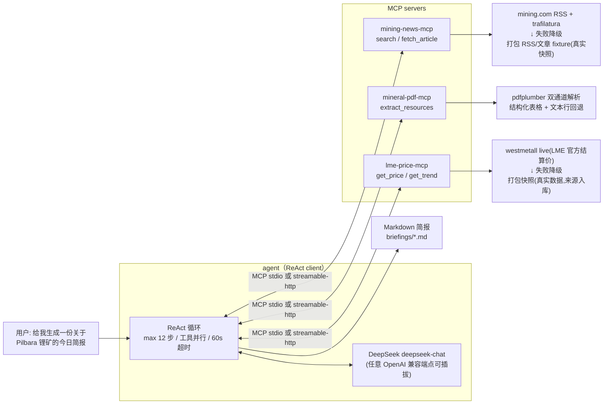

# mineral-daily-agent — 矿权日报 Agent（MCP 协议）

按 MCP（Model Context Protocol）协议实现的「矿权日报」系统：**3 个 MCP server + 1 个 ReAct Agent client**。

输入一句自然语言：

```
mineral-daily "给我生成一份关于 Pilbara 锂矿的今日简报"
```

输出一份 Markdown 简报：新闻摘要、储量数据、价格走势、风险提示，全部带引用源链接，落盘 `briefings/`。

**5 分钟跑起来 → [RUN.md](RUN.md)**（一条 docker-compose，或本地一条命令）。

## 架构



- **stdio 模式（默认）**：agent 用当前解释器把 3 个 server 拉成子进程——本地一条命令即是完整 MCP 部署，也是 Claude Desktop 的接入方式（[mcp-config.json](mcp-config.json)）。
- **streamable-http 模式**：`docker compose` 三容器分布式部署，agent 通过 `MCP_SERVERS` 环境变量寻址；healthcheck 是 MCP 层探针（完成真实 `initialize` 握手才算就绪，见 [healthcheck.py](src/mineral_daily/common/healthcheck.py)），比 TCP 探活更严格。

## 三个 MCP server

| server | 工具 | 数据源 | 降级策略 |
| --- | --- | --- | --- |
| mining-news-mcp | `search(query, days, limit)` · `fetch_article(url)` | mining.com RSS（`NEWS_FEEDS` 可扩展）+ trafilatura 正文抽取 | 10min/24h 磁盘缓存 → 过期缓存 → 打包 fixture（真实 RSS + 文章快照，采集脚本可复现） |
| mineral-pdf-mcp | `extract_resources(pdf_url)` | NI 43-101 / JORC 报告 PDF（URL / 本地路径 / `fixture`） | 结构化表格解析失败 → 文本行回退（置信度封顶 0.55）；`confidence < 0.5` = **abstain**，notes 提示人工核对 |
| lme-price-mcp | `get_price(commodity, date)` · `get_trend(commodity, days)` | 铜/锌/镍：westmetall（LME 官方结算价免费镜像）live；碳酸锂/铁矿石：打包快照 | live 失败 → 6h 缓存 → 过期缓存 → 快照；每条结果带 `source` 与 `is_live` 字段 |

### 对「登录墙 / 频控 / 反爬」的工程回应

价格官方源（LME 数据授权、上海钢联、SMM）有登录墙，新闻站有反爬——本项目不伪装绕过，而是：

1. **live 优先**：有免费合规镜像的（westmetall、RSS）实时抓，带 UA/超时/重试/磁盘缓存（频控友好）；
2. **降级透明**：每级降级写进工具返回的 `notes`/`source`/`is_live`，Agent 被系统提示词强制在简报「数据可用性」一节如实汇报；
3. **快照可溯源**：打包快照全部为真实数据（LME 三金属 62 个交易日实抓；碳酸锂来自生意社公开日度价；铁矿石来自 countryeconomy 月度均价），来源与截止日期写入数据文件与 [scripts/curate_manual_prices.py](scripts/curate_manual_prices.py)；
4. **PDF 反爬检测**：下载内容魔数校验，登录墙/重定向页不入缓存并给出可读报错与替代路径。

### PDF 解析的真实验证

对真实 ASX 公告《Pilgangoora Ore Reserve & Mineral Resource Update》(2023-08, 56 页) 实测：
文本行回退通道完整抽出 MRE（Measured 22.1 Mt @ 1.34% Li2O / Indicated 315.2 @ 1.15 / Inferred 76.6 @ 1.07 / Total 413.8 @ 1.15）与 Ore Reserve（Total 214.2 Mt，与公告标题一致），置信度如实标注 0.55 并提示人工核对；对不含储量表的公告正确返回空结果（真阴性）而非硬给。

## Agent 设计（自写 ReAct，不依赖编排框架）

1. **工具自动发现**：连接每个 server 后 `list_tools()`（循环 `nextCursor`，按规范支持分页），以 `server__tool` 命名空间转成 OpenAI function schema——新增 server 无需改 agent 代码；
2. **循环守护**：最大 12 步；单工具 60s 超时；同一步多个工具调用 `asyncio.gather` 并行；
3. **错误自适应**：工具失败以 `[tool error] …` 文本回喂模型换路（例如换 URL、换关键词），单 server 连接失败仅降级并记入简报；
4. **保证产出**：步数耗尽时禁用工具、注入强制合成提示，永远给出结构完整的简报；
5. **可溯源硬规则**：系统提示词要求每个事实附链接/来源字段，fixture 与低置信数据必须显著声明，缺数据写进「数据可用性」而非编造。

## 目录结构

```
├── src/mineral_daily/
│   ├── common/          http（重试/缓存/离线）· parsing · logging(stderr) · runner(双传输)
│   ├── servers/news/    server · feeds(RSS) · article(trafilatura) · data/(真实 fixture)
│   ├── servers/pdf/     server · parser(双通道) · models · data/(fixture PDF)
│   ├── servers/price/   server · providers(westmetall+快照) · data/prices_snapshot.json
│   └── agent/           main(CLI) · mcp_client(MCPFleet) · react · llm · briefing
│   └── evaluation/      scorecard(确定性质量评分) · llm_judge(可选 faithfulness)
├── tests/               56 用例：三 server 单测 + FakeLLM×真实 MCP stdio E2E + 评分器
├── eval/                简报质量评测:cases.jsonl · run_eval.py · README（反幻觉溯源）
├── scripts/             快照刷新 / fixture 采集 / fixture PDF 生成（全部可复现）
├── docker-compose.yml   3×streamable-http server + agent（healthcheck 编排）
├── mcp-config.json      Claude Desktop / Cursor 直接接入（stdio）
└── RUN.md               5 分钟运行手册（Docker / 本地 / Claude Desktop 三条路径）
```

## 简报可信吗:质量评测（eval/）

LLM 最危险的失败是"编一个看起来合理的数字"。[eval/](eval/) 用**确定性**方法(不依赖另一个
LLM,可离线在 CI 跑)对简报打分,核心是**反幻觉的数字溯源**:把简报数据表格里的每个数字
拿去和工具实际返回的数字比对,对不上就是疑似幻觉。真实运行一份 Pilbara 简报,评测报告:

```
[PASS] overall=1.0
  ✓ structure   1.0  章节齐全
  ✓ citations   1.0  新闻章节含 3 个来源链接
  ✓ grounding   1.0  33 个表格数字全部溯源到工具返回      ← 零编造
  ✓ honesty     1.0  已如实声明数据降级
```

五项检查(structure / citations / grounding / honesty / topicality)+ 可选 LLM faithfulness
评审,详见 [eval/README.md](eval/README.md)。`python eval/run_eval.py --trace <run.json>` 离线即可评分。

## 工程规范

- **测试**：`pytest` 56 用例全离线可跑（respx 模拟 http、真实 fixture、真实 MCP stdio E2E、评分器正反例），`network` 标记的实网用例默认跳过；CI 附覆盖率报告（pytest-cov）；
- **质量评测**：`eval/` 对简报做反幻觉数字溯源等五项确定性打分，CI 用打包样例自检评分器；
- **Lint / 类型**：`ruff check` 与 `mypy src` 零告警；
- **供应链**：[requirements.lock](requirements.lock)（`uv pip compile --universal` 生成，跨平台 marker）锁定依赖，Docker 按锁安装保证可复现构建；CI 独立作业跑 `pip-audit` 审计锁内依赖；
- **CI**：GitHub Actions，Python 3.11–3.13 矩阵（ruff + mypy + pytest + coverage）+ audit 作业；
- **结构化输出**：五个工具均以 pydantic 模型返回 → 通过 MCP `outputSchema` / `structuredContent` 发布，client 可做结构化校验；
- **配置即环境变量**：`.env.example` 全量注释，LLM 端点/模型/数据源均可插拔；
- **日志**：全部走 stderr——stdout 是 MCP stdio 的 JSON-RPC 信道，这是 MCP server 的硬约束；
- **HTTP 传输安全**：按 MCP 规范默认启用 Host/Origin 校验（DNS-rebinding 防护，白名单经 `MCP_ALLOWED_HOSTS` 扩展）；compose 端口仅发布到宿主机 loopback；容器以非 root 用户运行；healthcheck 为 MCP 层握手探针。

## 已知局限（诚实声明）

- PDF 解析为启发式（关键词定位 + 表头映射 + 文本行回退），对扫描件（无文本层）与复杂多分区表格覆盖有限——此时按 abstain 语义返回空/低置信而非猜测；
- 碳酸锂/铁矿石无免费可编程 live 源，快照会随时间老化（`as_of` 字段与简报中会体现）；
- 新闻默认单源 mining.com（`NEWS_FEEDS` 可加源）；RSS 仅覆盖近几十条，不做历史回溯；
- 简报质量最终受 LLM 影响；系统通过溯源硬规则 + 步数/超时守护 + 强制合成兜底约束，但不能完全消除模型误读。

## 功能与代码导航

| 功能 | 位置 |
| --- | --- |
| mining-news-mcp：`search` / `fetch_article` | [src/mineral_daily/servers/news/](src/mineral_daily/servers/news/) |
| mineral-pdf-mcp：`extract_resources`（NI 43-101 Indicated/Inferred） | [src/mineral_daily/servers/pdf/](src/mineral_daily/servers/pdf/) |
| lme-price-mcp：`get_price` / `get_trend` | [src/mineral_daily/servers/price/](src/mineral_daily/servers/price/) |
| Agent 主流程（Pilbara 锂矿简报 → Markdown + 引用） | [src/mineral_daily/agent/](src/mineral_daily/agent/) |
| client 端 Agent 编排（自写 ReAct） | [src/mineral_daily/agent/react.py](src/mineral_daily/agent/react.py) |
| mcp-config.json（Claude Desktop / Cursor） | [mcp-config.json](mcp-config.json) |
| RUN.md（5 分钟，含一条 docker-compose） | [RUN.md](RUN.md) |
